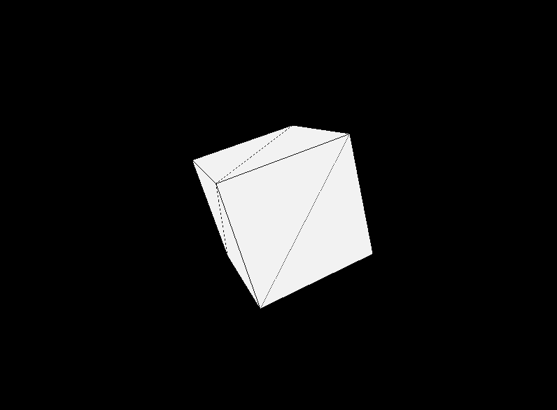

# Project Lightbox
Three.js study repository

| Project Started | Last Update | Version |
| :-------------- | :---------- | :-----: |
| 29 Jul 2023     | 01 Aug 2023 | 0.11    |

# Table of Contents

# Installation and Use
- Clone setup
- Install
- Start program
- Important

# Feature List

# Controls

# Display
```
0.11 Hello Cube
```



# References and Links
- Learning
    - 
- Dependencies
    - npm 
    - vite | current version: 4.4.1 | `npm create vite@latest`
        - cd <project_folder>
        - npm install 
        - npm run dev
    - three.js | `npm install three`
- Data

[Return to top]()


