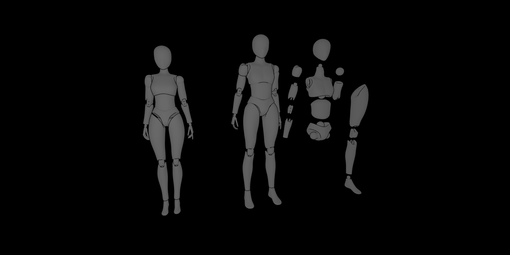

# Project Lightbox
Three.js study repository

| Project Started | Last Update | Version |
| :-------------- | :---------- | :-----: |
| 29 Jul 2023     | 02 Aug 2023 | 0.12    |

# Table of Contents

# Installation and Use
- Clone setup
- Install
- Start program
- Important

# Feature List

# Controls

# Display
```cpp
0.12 Model upload
Model by ChamberSu1996-Sketchfab
```


```
0.11 Hello Cube
```


# References and Links
- Learning
    - video
        - [Delaney, Jeff. _Youtube Channel Fireship, Youtube_. 2021.](https://youtu.be/Q7AOvWpIVHU)
    - repository
        - ["three-js-tutorials". _by Suboptimal Engineer in Github_. 2022.](https://github.com/SuboptimalEng/three-js-tutorials/tree/main)
    - docs
        - [Three.js docs](https://threejs.org/docs/)
- Dependencies
    - npm 
    - vite | current version: 4.4.1 | `npm create vite@latest`
        - cd <project_folder>
        - npm install 
        - npm run dev
    - three.js | 9.6.7 | `npm install three` 
    - dat.gui  |       | `npm install dat.gui`
- Data
    - [svgrepo.com](https://www.svgrepo.com/)
    - [glTF Sample Models](https://github.com/KhronosGroup/glTF-Sample-Models)
    - [Ball Joint Doll Rigged Basemesh - Male Ver. by ChamberSu1996-Sketchfab](https://sketchfab.com/3d-models/ball-joint-doll-rigged-basemesh-male-ver-b97b7ec205764515b7737f52cdaf207d)
    - [Street Food Vendor Challenge by Berk Gedik-Sketchfab](https://sketchfab.com/3d-models/street-food-vendor-challenge-kokorec-141db37d07fc4ccba84ab5f38a8181b5)

[Return to top]()


